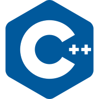
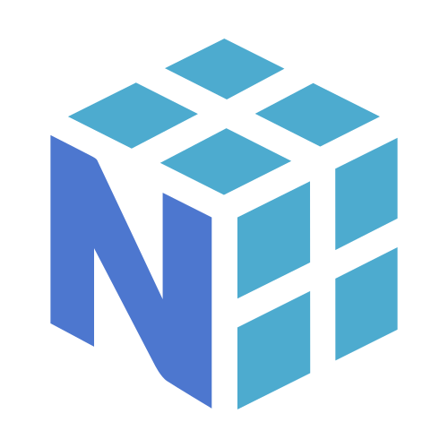

# Hong Chen

### M.Sc. Telecommunication Engineering · Politecnico di Milano

<picture>
  <source media="(prefers-color-scheme: dark)" srcset="assets/focus-dark.svg">
  <source media="(prefers-color-scheme: light)" srcset="assets/focus-light.svg">
  
</picture>

Building efficient, measurable systems across AI, signals, communications, and high-performance networks.

<a href="https://www.linkedin.com/in/hong-chen-6608ba337/"><picture><source media="(prefers-color-scheme: dark)" srcset="assets/social/linkedin-dark.svg"></picture></a>&nbsp;&nbsp;<a href="mailto:arnochan2024@gmail.com"><picture><source media="(prefers-color-scheme: dark)" srcset="assets/social/email-dark.svg"></picture></a>&nbsp;&nbsp;<a href="https://arnochanpolimi.github.io"><picture><source media="(prefers-color-scheme: dark)" srcset="assets/social/portfolio-dark.svg"></picture></a>

 

  &nbsp;&nbsp;&nbsp;
  &nbsp;&nbsp;&nbsp;
  
  &nbsp;&nbsp;&nbsp;&nbsp;&nbsp;&nbsp;&nbsp;&nbsp;
  &nbsp;&nbsp;&nbsp;
  &nbsp;&nbsp;&nbsp;
  &nbsp;&nbsp;&nbsp;
  &nbsp;&nbsp;&nbsp;
  

---

### Selected Work

<table>
<tr>
<td width="50%" valign="top">

**[NCCL/RDMA Performance Engineering](https://github.com/ArnoChanPolimi/NCCL-RDMA-Performance-Tuning)**  
Master's thesis on communication efficiency and performance tuning for distributed AI infrastructure. *Documentation only during disclosure review.*

</td>
<td width="50%" valign="top">

**[Scalable Recommender Systems](https://github.com/ArnoChanPolimi/RecSys_PoliMi_Challenge_2025)**  
Hybrid ranking over **3.8M interactions** using sparse computation, Cython, and Bayesian optimization.

</td>
</tr>
<tr>
<td width="50%" valign="top">

**[O-RAN Closed-Loop Control](https://github.com/ArnoChanPolimi/mrn-oran-m2-project2)**  
BER-driven multi-UE MCS control across gNB emulation, E2 signaling, and an xApp.

</td>
<td width="50%" valign="top">

**[77 GHz Radar Vital-Sign Sensing](https://github.com/ArnoChanPolimi/mmWave-Radar-Vital-Sign-Detection)**  
FMCW signal processing for contactless heart- and breathing-rate estimation.

</td>
</tr>
</table>

### Education

**Politecnico di Milano** — M.Sc. Telecommunication Engineering  
**Beijing Institute of Technology** — B.Eng. Electronic and Information Engineering  
**ENSEA, France** — Erasmus exchange · Networks, Telecommunications and Security

### Activity & Languages

  <picture>
    <source media="(prefers-color-scheme: dark)" srcset="https://github-profile-summary-cards.vercel.app/api/cards/profile-details?username=ArnoChanPolimi&amp;theme=github_dark">
    <source media="(prefers-color-scheme: light)" srcset="https://github-profile-summary-cards.vercel.app/api/cards/profile-details?username=ArnoChanPolimi&amp;theme=github">
    
  </picture>

  <picture>
    <source media="(prefers-color-scheme: dark)" srcset="https://github-readme-stats.vercel.app/api/top-langs/?username=ArnoChanPolimi&amp;layout=compact&amp;langs_count=6&amp;hide=Jupyter%20Notebook,HTML,CSS&amp;exclude_repo=HongersTravelMapRecordings,ArnoChanPolimi.github.io&amp;hide_border=true&amp;theme=github_dark">
    <source media="(prefers-color-scheme: light)" srcset="https://github-readme-stats.vercel.app/api/top-langs/?username=ArnoChanPolimi&amp;layout=compact&amp;langs_count=6&amp;hide=Jupyter%20Notebook,HTML,CSS&amp;exclude_repo=HongersTravelMapRecordings,ArnoChanPolimi.github.io&amp;hide_border=true">
    
  </picture>
  <picture>
    <source media="(prefers-color-scheme: dark)" srcset="https://github-profile-summary-cards.vercel.app/api/cards/most-commit-language?username=ArnoChanPolimi&amp;theme=github_dark&amp;exclude=Jupyter%20Notebook,HTML,CSS">
    <source media="(prefers-color-scheme: light)" srcset="https://github-profile-summary-cards.vercel.app/api/cards/most-commit-language?username=ArnoChanPolimi&amp;theme=github&amp;exclude=Jupyter%20Notebook,HTML,CSS">
    
  </picture>

