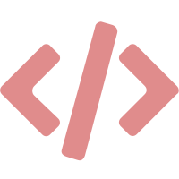
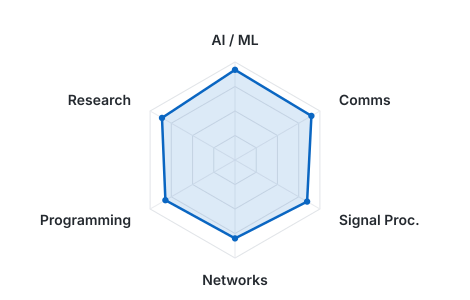
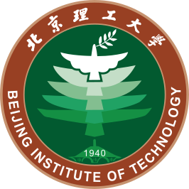
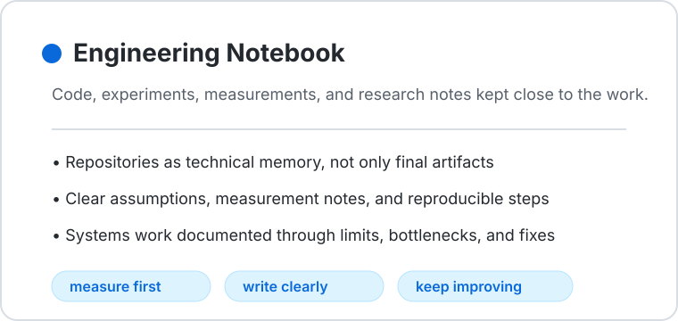
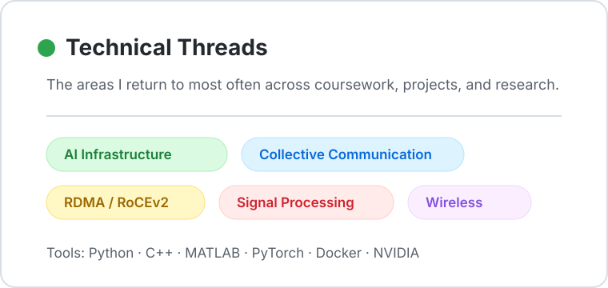

# Hong Chen

### M.Sc. Telecommunication Engineering · Politecnico di Milano

<picture>
  <source media="(prefers-color-scheme: dark)" srcset="assets/focus-dark.svg">
  <source media="(prefers-color-scheme: light)" srcset="assets/focus-light.svg">
  
</picture>

From the mountains of Gansu to Beijing, Milan, and Cergy, I keep following the same quiet question:
how can invisible things — signals, gradients, channels, noise, motion — be measured, understood, and made useful?

I build and study systems at the edge of **AI infrastructure**, **communication networks**, and **signal processing**.

<a href="https://www.linkedin.com/in/hong-chen-6608ba337/"><picture><source media="(prefers-color-scheme: dark)" srcset="assets/social/linkedin-dark.svg"></picture></a>&nbsp;&nbsp;<a href="mailto:arnochan2024@gmail.com"><picture><source media="(prefers-color-scheme: dark)" srcset="assets/social/email-dark.svg"></picture></a>&nbsp;&nbsp;<a href="https://arnochanpolimi.github.io"><picture><source media="(prefers-color-scheme: dark)" srcset="assets/social/portfolio-dark.svg"></picture></a>

 

  &nbsp;&nbsp;&nbsp;
  &nbsp;&nbsp;&nbsp;
  &nbsp;&nbsp;&nbsp;
  
  &nbsp;&nbsp;&nbsp;&nbsp;&nbsp;&nbsp;&nbsp;&nbsp;
  &nbsp;&nbsp;&nbsp;
  &nbsp;&nbsp;&nbsp;
  &nbsp;&nbsp;&nbsp;
  &nbsp;&nbsp;&nbsp;
  

---

### About

I am a Telecommunication Engineering master's student at **Politecnico di Milano**. Before Milan, I studied Electronic and Information Engineering at **Beijing Institute of Technology**, where circuits, signals, and probability slowly became more than coursework: they became a way for me to listen to the hidden structure of the world.

My current research is about **cross-geo communication for large-scale AI training**: how GPUs separated by geography can still learn together without losing too much time to distance. I work on the quiet but costly part of distributed learning — the waiting, synchronization, and network overhead between machines that must exchange gradients before the next step can begin. I am tuning and studying collective-communication libraries such as **NCCL**, **MSCCL**, and **ScaleCCL**, with the goal of reducing idle time and letting expensive computation spend more of its life actually learning.

I am drawn to engineering because it keeps me honest. A sentence can sound beautiful and still be empty; a system cannot. It either runs, measures, fails, bottlenecks, or teaches you where your understanding was too shallow. That is the kind of clarity I like: precise, patient, and still full of wonder.

### Questions I Keep Returning To

- How can large AI training systems waste less time waiting on communication?
- How can fragile signals — radar phase, video traces, noisy measurements — be recovered into something trustworthy?
- How does information move through channels, protocols, and feedback loops when the world is not ideal?
- How can engineering stay measurable and useful without losing the original curiosity that made the problem beautiful?

### Selected Work & Research Threads

<table>
<tr>
<td width="50%" valign="top">

**[NCCL/RDMA Performance Engineering](https://github.com/ArnoChanPolimi/NCCL-RDMA-Performance-Tuning)**  
My master's-thesis direction: profiling and tuning collective communication for distributed AI training over high-performance networks. I care about the quiet loss hidden inside "waiting" — the time GPUs spend blocked by synchronization, transport behavior, and network bottlenecks. 
<b>Topics:</b> NCCL · MSCCL · ScaleCCL · RDMA/RoCEv2 · cross-geo training · measurement

</td>
<td width="50%" valign="top">

**[Scalable Recommender Systems](https://github.com/ArnoChanPolimi/RecSys_PoliMi_Challenge_2025)**  
A recommender-system challenge built on **3.8M interactions**, where accuracy depended not only on model choice but on careful sparse computation, feature design, ensembling, and fast iteration. 
<b>Topics:</b> EASE · SLIM · iALS · Cython · Bayesian optimization

</td>
</tr>
<tr>
<td width="50%" valign="top">

**[O-RAN Closed-Loop Control](https://github.com/ArnoChanPolimi/mrn-oran-m2-project2)**  
A network-control project where radio behavior becomes feedback: BER measurements guide multi-UE MCS decisions through gNB emulation, E2 signaling, and an xApp loop. 
<b>Topics:</b> Open RAN · E2AP · xApp · control loops

</td>
<td width="50%" valign="top">

**[77 GHz Radar Vital-Sign Sensing](https://github.com/ArnoChanPolimi/mmWave-Radar-Vital-Sign-Detection)**  
A sensing project that made me love the tenderness of signal processing: small chest motion, buried in phase and noise, recovered into breathing and heart-rate estimates without contact. 
<b>Topics:</b> FMCW radar · phase unwrapping · FFT · physiological sensing

</td>
</tr>
</table>

### Focus areas

The map below is not a ranking as much as a compass. I keep moving between systems that compute, systems that communicate, and signals that ask to be recovered.

  <picture>
    <source media="(prefers-color-scheme: dark)" srcset="assets/charts/radar-dark.svg">
    
  </picture>

### Education

Each school below links to a longer story. I arranged them chronologically so the education section reads from undergraduate study to master's study and exchange.

&nbsp;&nbsp;<strong><a href="https://github.com/ArnoChanPolimi/ArnoChanPolimi/blob/main/stories/bit.md">Beijing Institute of Technology</a></strong>&nbsp; — B.Eng. Electronic and Information Engineering · 2019–2023

&nbsp;&nbsp;<strong><a href="https://github.com/ArnoChanPolimi/ArnoChanPolimi/blob/main/stories/polimi.md">Politecnico di Milano</a></strong>&nbsp; — M.Sc. Telecommunication Engineering · 2024–2026

&nbsp;&nbsp;<strong><a href="https://github.com/ArnoChanPolimi/ArnoChanPolimi/blob/main/stories/ensea.md">ENSEA, France</a></strong>&nbsp; — Erasmus exchange · Networks, Telecommunications and Security · 2025–26

### GitHub

I use GitHub partly as an engineering notebook: code, experiments, measurements, and the occasional attempt to make technical work feel a little more alive.

  <picture>
    <source media="(prefers-color-scheme: dark)" srcset="assets/github-notebook-dark.svg">
    
  </picture>
  &nbsp;
  <picture>
    <source media="(prefers-color-scheme: dark)" srcset="assets/github-threads-dark.svg">
    
  </picture>

