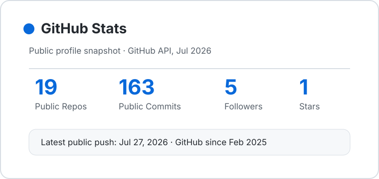
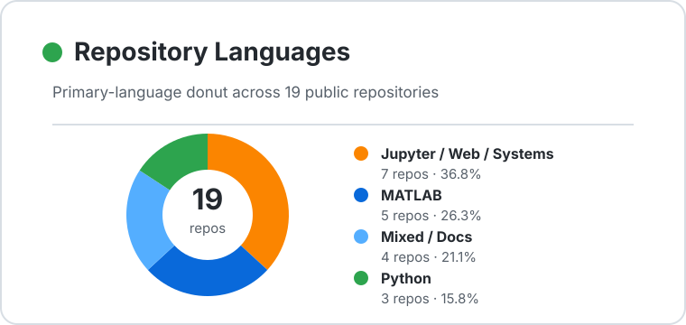

# Hong Chen

**M.Sc. student in Telecommunication Engineering · Politecnico di Milano**

I study communication and networking for distributed AI training. My master's thesis is based in the [BONSAI Lab](https://www.bonsai.deib.polimi.it/), DEIB, under the supervision of [Qiaolun Zhang](https://qiaolunzhang.github.io/) and [Massimo Tornatore](https://tornatore.faculty.polimi.it/).

  <a href="https://arnochanpolimi.github.io"><picture><source media="(prefers-color-scheme: dark)" srcset="assets/social/portfolio-dark.svg"></picture></a>
  <a href="https://www.linkedin.com/in/hongchen-arno/"><picture><source media="(prefers-color-scheme: dark)" srcset="assets/social/linkedin-dark.svg"></picture></a>
  <a href="mailto:arnochan2024@gmail.com"><picture><source media="(prefers-color-scheme: dark)" srcset="assets/social/email-dark.svg"></picture></a>
  

## Current research

My thesis focuses on AI training across datacenters. I study how collective communication schedules and WAN routing can adapt together when available bandwidth changes. I build and measure a GPU testbed to understand how these choices affect communication time and training performance.

The work involves PyTorch FSDP, NCCL/MSCCL, and RDMA over RoCEv2. My [NCCL/RDMA repository](https://github.com/ArnoChanPolimi/NCCL-RDMA-Performance-Tuning) collects related performance-tuning work.

## Selected projects

### [Scalable recommender systems](https://github.com/ArnoChanPolimi/RecSys_PoliMi_Challenge_2025)

Combined EASE, SLIM, and iALS models on a dataset of 3.8 million interactions, with ensemble weights tuned through Bayesian optimization.

Python · Sparse matrices · Cython · Recommendation

### [O-RAN closed-loop control](https://github.com/ArnoChanPolimi/mrn-oran-m2-project2)

Used BER measurements to guide modulation and coding decisions for multiple users, connecting gNB emulation, E2 signaling, and an xApp control loop.

Open RAN · E2AP · xApp · Network control

### [77 GHz radar vital-sign sensing](https://github.com/ArnoChanPolimi/mmWave-Radar-Vital-Sign-Detection)

Estimated breathing and heart rate from small chest movements using FMCW radar, phase processing, and frequency analysis.

MATLAB · Signal processing · FMCW radar

## Education

**[Politecnico di Milano](stories/polimi.md)** · Italy 
M.Sc. in Telecommunication Engineering 
Sep. 2024 – Dec. 2026 (expected)

**[ENSEA](stories/ensea.md)** · France 
Erasmus exchange · Networks, wireless communications, and security 
Sep. 2025 – Jan. 2026

**[Beijing Institute of Technology](stories/bit.md)** · China 
B.Sc. in Electronic Information Engineering · School of Information and Electronics 
Sep. 2019 – Jun. 2023

## Beyond the code

I grew up in Gansu and have since lived and studied in Beijing, Milan, and Cergy. I enjoy traveling and photography; the school links above lead to a few stories from those years.

Email is the best way to reach me; I check it regularly: [arnochan2024@gmail.com](mailto:arnochan2024@gmail.com).

GitHub statistics

  <picture>
    <source media="(prefers-color-scheme: dark)" srcset="assets/github-stats-dark.svg">
    
  </picture>
  <picture>
    <source media="(prefers-color-scheme: dark)" srcset="assets/github-languages-dark.svg">
    
  </picture>

