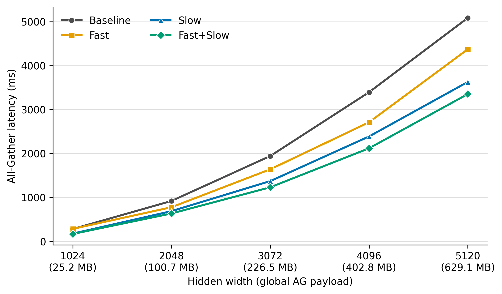
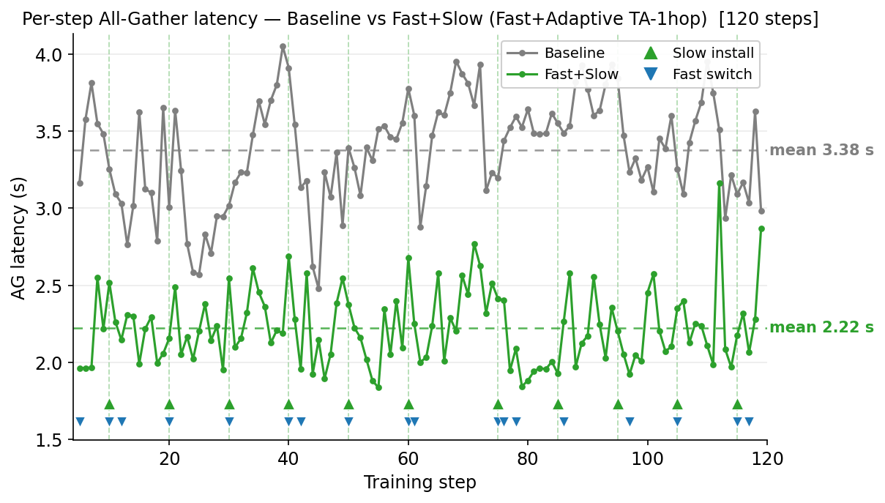
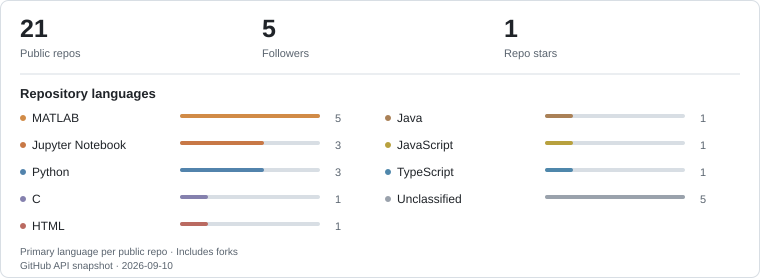

### Hi, I'm Hong.

I'm a master's student in Telecommunication Engineering at **Politecnico di Milano**, working on distributed AI training in the [BONSAI Lab](https://www.bonsai.deib.polimi.it/) with [Qiaolun Zhang](https://qiaolunzhang.github.io/) and [Massimo Tornatore](https://tornatore.faculty.polimi.it/).

My thesis studies how to reduce communication delays when training AI models across datacenters. As available bandwidth changes, I explore how GPU communication schedules and network routes can adapt together. I am building a GPU testbed to compare these choices and measure their effect on communication time and training performance.

<table>
<tr>
<td width="50%" align="center" valign="top"> <strong>Across workload sizes</strong> Four control modes · All-Gather latency (ms)</td>
<td width="50%" align="center" valign="top"> <strong>During online operation</strong> Baseline vs. Fast+Slow · 120 training steps (s)</td>
</tr>
</table>

Two separate experiments: workload scaling and an illustrative online run. Lower All-Gather latency is better. Click either figure to enlarge.

&nbsp;&nbsp;&nbsp;&nbsp;&nbsp;&nbsp;&nbsp;&nbsp;&nbsp;

### Selected work

- **[NCCL / RDMA performance](https://github.com/ArnoChanPolimi/NCCL-RDMA-Performance-Tuning)** — Profiling and tuning collective communication for distributed training.
- **[Recommender systems](https://github.com/ArnoChanPolimi/RecSys_PoliMi_Challenge_2025)** — Combining sparse models on 3.8 million interactions.
- **[O-RAN control](https://github.com/ArnoChanPolimi/mrn-oran-m2-project2)** — Using radio measurements to guide modulation and coding decisions.
- **[Radar vital-sign sensing](https://github.com/ArnoChanPolimi/mmWave-Radar-Vital-Sign-Detection)** — Estimating breathing and heart rate from 77 GHz radar signals.

 
&nbsp;&nbsp;&nbsp;&nbsp;&nbsp;&nbsp;&nbsp;&nbsp;&nbsp;&nbsp;&nbsp;&nbsp;&nbsp;&nbsp;&nbsp;&nbsp;&nbsp;&nbsp;&nbsp;&nbsp;&nbsp;&nbsp;&nbsp;&nbsp;

### Education

Three places I have studied, with stories and photographs from each.

<table>
<tr><td width="64" align="center" valign="middle"></td><td valign="top"><a href="https://github.com/ArnoChanPolimi/ArnoChanPolimi/blob/main/stories/polimi.md"><strong>Politecnico di Milano</strong></a>&nbsp;  M.Sc. in Telecommunication Engineering Sep. 2024 – Dec. 2026 (expected)</td></tr>
<tr><td width="64" align="center" valign="middle"></td><td valign="top"><a href="https://github.com/ArnoChanPolimi/ArnoChanPolimi/blob/main/stories/ensea.md"><strong>ENSEA, France</strong></a>&nbsp;  Erasmus exchange · Networks, wireless communications, and security Sep. 2025 – Jan. 2026</td></tr>
<tr><td width="64" align="center" valign="middle"></td><td valign="top"><a href="https://github.com/ArnoChanPolimi/ArnoChanPolimi/blob/main/stories/bit.md"><strong>Beijing Institute of Technology</strong></a>&nbsp;  B.Sc. in Electronic Information Engineering Sep. 2019 – Jun. 2023</td></tr>
</table>

### GitHub at a glance

<picture>
  <source media="(max-width: 760px) and (prefers-color-scheme: dark)" srcset="assets/stats-dark-mobile.svg">
  <source media="(max-width: 760px)" srcset="assets/stats-light-mobile.svg">
  <source media="(prefers-color-scheme: dark)" srcset="assets/stats-dark.svg">
  
</picture>
