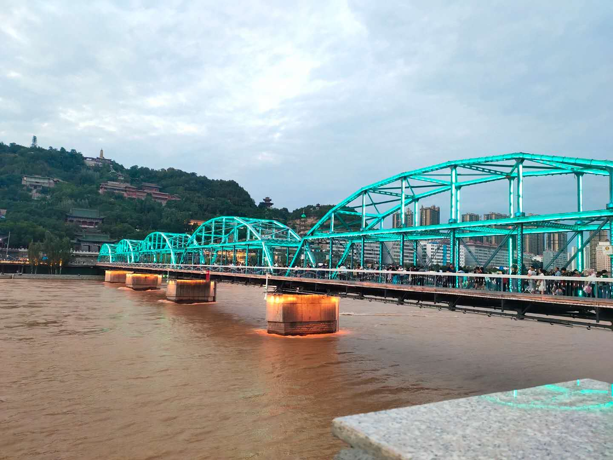
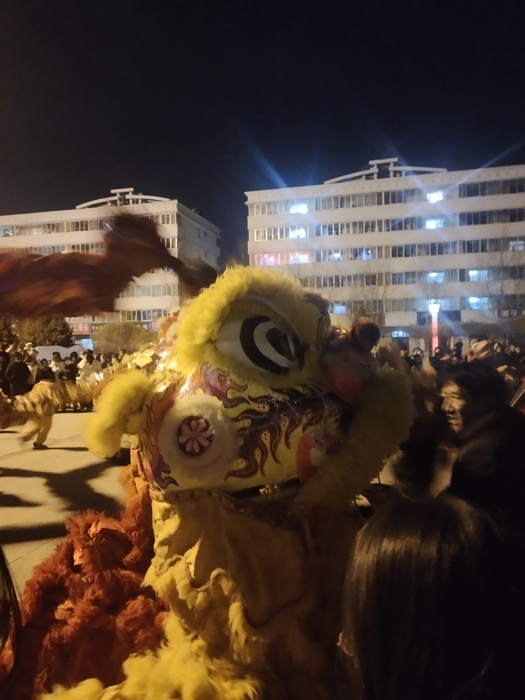
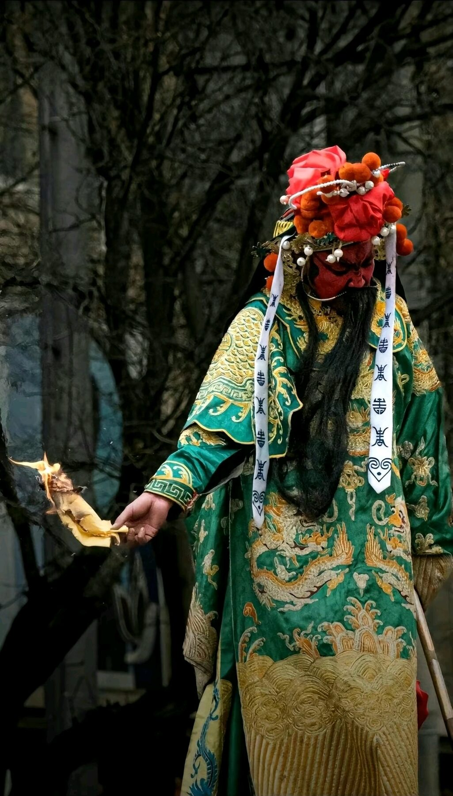
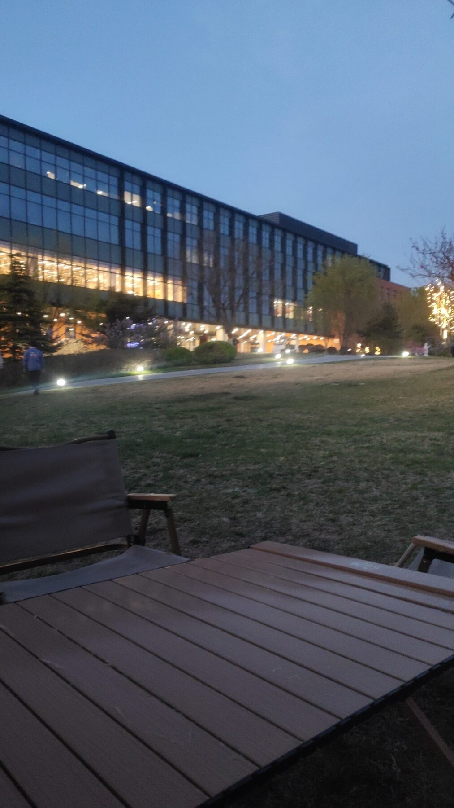

# Beijing Institute of Technology · 2019–2023

`B.Eng. Electronic and Information Engineering · Beijing, China`

I arrived in Beijing in the autumn of 2019 to study **Electronic and Information Engineering** at **Beijing Institute of Technology**. Before Beijing, there was Gansu: mountains, long distances, the Yellow River, festival colors in winter streets, and a childhood that taught me to notice every small opening carefully.

Beijing was larger than any place I had known. At first it felt dry, fast, and difficult to read. I had entered university through examinations, so I was used to clear targets: a score, a ranking, a gate crossed. The city did not work like that. It asked me to build a rhythm before I could feel steady inside it.

  
   Liangxiang campus by the water — the first large landscape that slowly became familiar.

Before Beijing, home was not an abstract origin. It had a river, winter festivals, mountain light, and streets where memory felt close to the ground. I did not carry those places as decoration; I carried them as a measure of distance. They made Beijing feel enormous at first, but they also made every new step more concrete.

  
   The Yellow River in Lanzhou, where distance first had a shape.

  
  
   Festival colors from Gansu: bright, local, and impossible to confuse with anywhere else.

The first year was mostly a process of learning how to live in a much larger environment. A dorm room became familiar. Then a library seat. Then the path to class, the canteen at certain hours, the winter air around Liangxiang, and the campus lights after evening study.

Those details mattered because they turned a huge city into a place I could actually move through. University life was not only lectures and exams. It was also repetition: carrying books, waiting for dinner, debugging assignments, returning to a difficult chapter the next morning. That repetition slowly gave me a sense of order.

  
  
   Gongxun Building and the clean geometry of campus days.

  
   Beihu in winter, when Liangxiang became quiet enough to hear one's own thoughts.

Academically, BIT gave me the language I needed for questions I had carried for a long time. I was drawn to physics because it asked what the world was doing beneath ordinary appearances. Electronic and information engineering made that curiosity practical. Signals, fields, circuits, probability, and communication systems showed me that invisible things could be measured, shaped, transmitted, and recovered.

I liked the discipline of it. A signal is not meaningful because we wish it to be. It has to survive noise, loss, delay, and imperfect hardware. A system either works, fails, or reveals the part we did not understand. That clarity suited me. It made curiosity less vague and more responsible.

  
  
   Engineering felt close to the hand: prototypes, small boards, and patient correction.

Some of the best learning happened outside the formal structure of class. A breadboard under a desk lamp. A Raspberry Pi that refused to behave. A program failing for one small reason I had not seen. These were ordinary engineering moments, but they taught me how technical patience works: observe, test, narrow the problem, change one thing, test again.

When the result finally appeared - an LED blinking, data printing correctly, a small device responding - it was not dramatic. It was better than dramatic. It was repeatable. It was a small piece of the world agreeing to be understood.

  
   Yuyuantan in spring: open sky, the central tower, and Beijing becoming softer for a day.

  
  
   Blossoms and a small meal after walking — ordinary details that made the city less severe.

The pandemic affected most of my undergraduate years. It changed schedules, closed gates, interrupted plans, and made PCR tests part of ordinary student life. There were repeated periods of being sealed inside campus or at home, and the uncertainty became tiring in a way that is hard to explain neatly.

The most difficult part was not one single event. It was the repetition: restrictions, openings, new rules, waiting, another test, another changed plan. Then in December 2022, everything changed suddenly. Looking back, that period still feels unreal. It took away some of the freedom that should have belonged naturally to those years.

In the final year, my undergraduate thesis focused on **multi-node cooperative directional transmission in wireless ad hoc networks**. The goal was simple to state but demanding to build: in a network without fixed infrastructure or a central base station, several nodes try to coordinate their transmissions so that their signals add up in a useful direction instead of spreading energy everywhere.

The work had two main parts. First, the nodes needed accurate time and frequency synchronization; otherwise, cooperation would only create disorder. Then, after synchronization, the transmission parameters could be adjusted through feedback so that a directional beam gradually formed. Most of my experiments were MATLAB simulations, including different node layouts and feedback strategies for distributed beamforming.

By the hot, dry end of May, after several months of work, I finally completed the thesis. I remember the lab near sunset: equipment on the table, simulation figures waiting to be checked, data to be saved, small errors still asking for attention. It was not a cinematic moment, but it was a clear one. A long task had reached its end, and I could see how much my way of thinking had changed since I first arrived in Beijing.

  
   Fuchun River, another quiet measure of distance in China.

  
  
   Outside the strict rhythm of study, there were brief sparks, city lights, and wider roads.

I left BIT with a stronger technical foundation, but also with a habit that mattered even more: when something is unclear, do not rush to decorate it. Measure it, question it, simplify it, and understand where the difficulty really is.

---

[← Back to profile](https://github.com/ArnoChanPolimi)
