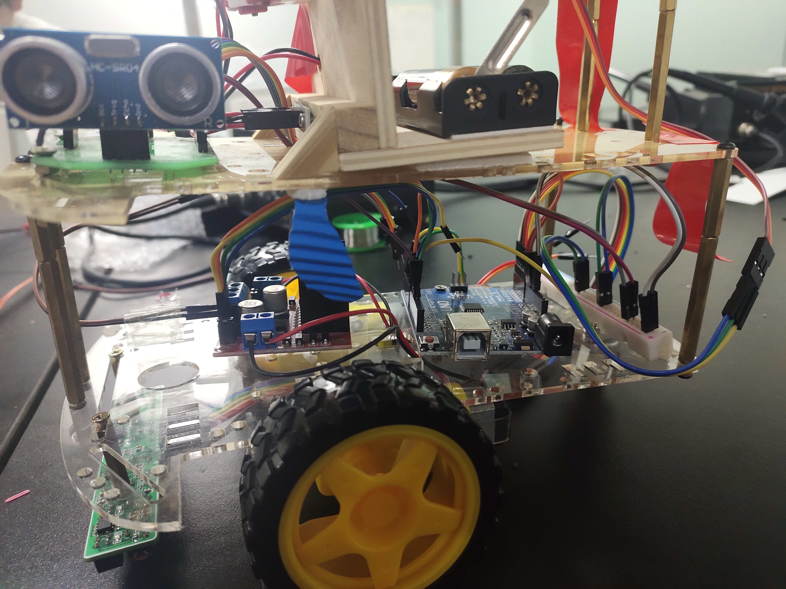
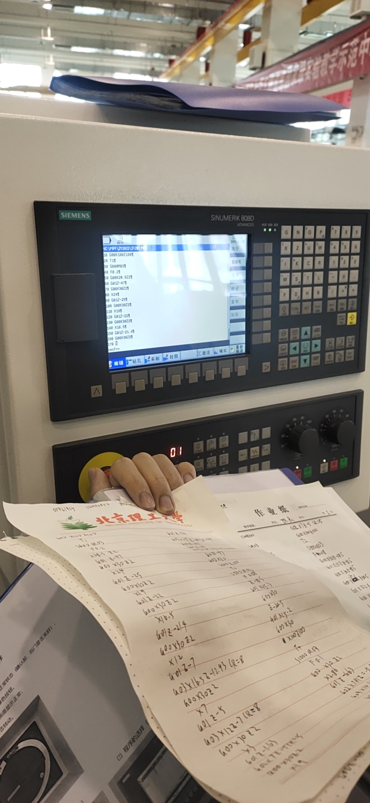

# Beijing Institute of Technology · 2019–2023

B.Sc. in Electronic Information Engineering · School of Information and Electronics

I enrolled at Beijing Institute of Technology in September 2019 to study Electronic Information Engineering.

For the first two years, I was unsure which direction I wanted to pursue, or even which subjects interested me most. I explored several areas within the degree, including communications, electromagnetics, and signal-processing algorithms. I had not yet settled on a particular field.

 

## Home in Gansu

Before Beijing, home was not an abstract origin. It had a river, winter festivals, mountain light, and streets where memory felt close to the ground. I did not carry those places as decoration; I carried them as a measure of distance. They made Beijing feel enormous at first, but they also made every new step more concrete.

The colors of Gansu were very different from the gray speed of Beijing. Shehuo, the Yellow River, and the dry air of Lanzhou belonged to a world where tradition was not a museum word; it was sound, clothing, dust, and people standing close together in the street. I think that is why I was always sensitive to place. A city was never only a city to me. It was light, texture, weather, and the way a person learns to breathe inside it.

 

## My first competition

An Arduino car competition was my first experience of this kind of project. My teammates and I assembled a remote-controlled car and added components, including infrared and ultrasonic modules. We worked on controlling its movement, following a track, and using motors to launch small projectiles.

Looking back, the individual modules were fairly basic. At the time, though, it was our first attempt to assemble everything ourselves, and getting the parts to work together was a substantial challenge.

We searched online for information, wrote code, and kept testing and debugging as a team. There was a lot to figure out, but it was also a fun beginning: we were building something together and learning how to make it work.

 

## My undergraduate thesis

Later, I completed my undergraduate thesis under the guidance of <strong>Prof. Qin Zhang</strong> and the team. The topic was <em>multi-node cooperative directional transmission in wireless ad hoc networks</em>.

I studied how separate wireless nodes could coordinate their transmissions so that their signals combined in a chosen direction. The work involved two connected problems: synchronizing the nodes in time and frequency, and using feedback to adjust their transmissions for distributed beamforming. I evaluated these methods through simulations.

I graduated in June 2023 with a B.Sc. in Electronic Information Engineering.

## Photographs

&nbsp;&nbsp;

 

<a href="https://github.com/ArnoChanPolimi">← Back to profile</a>

