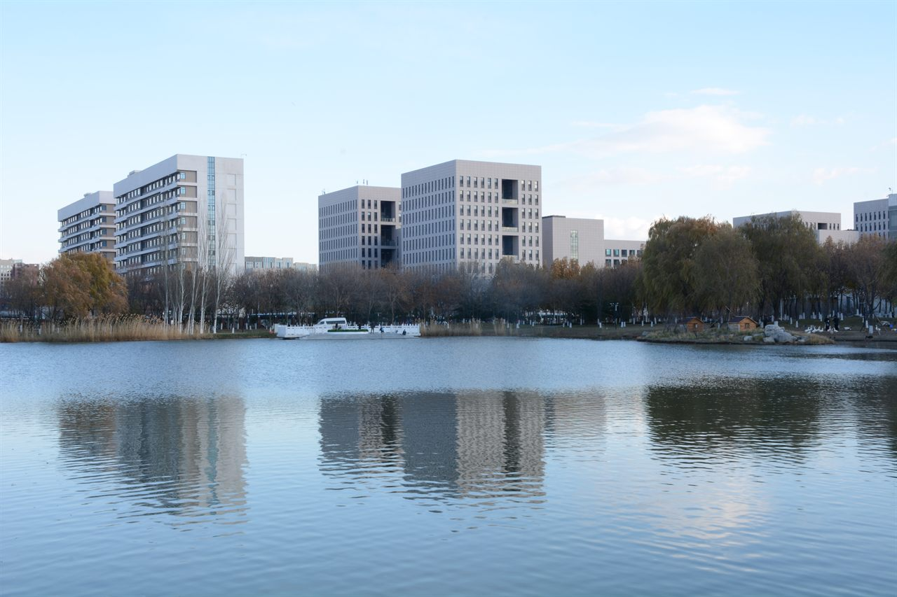
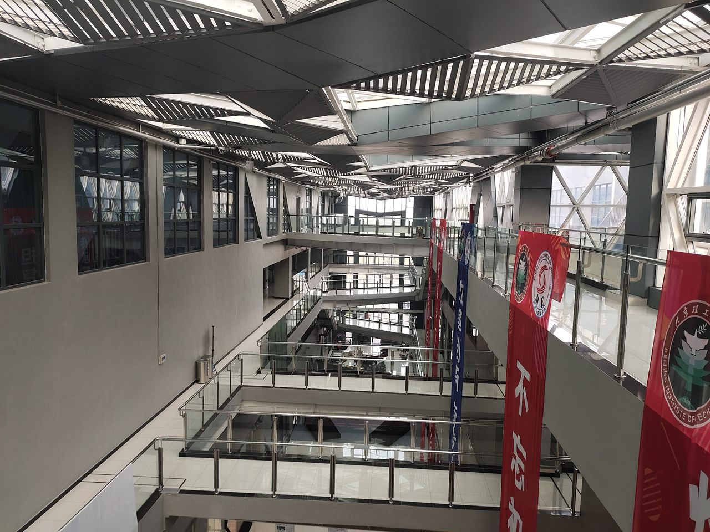
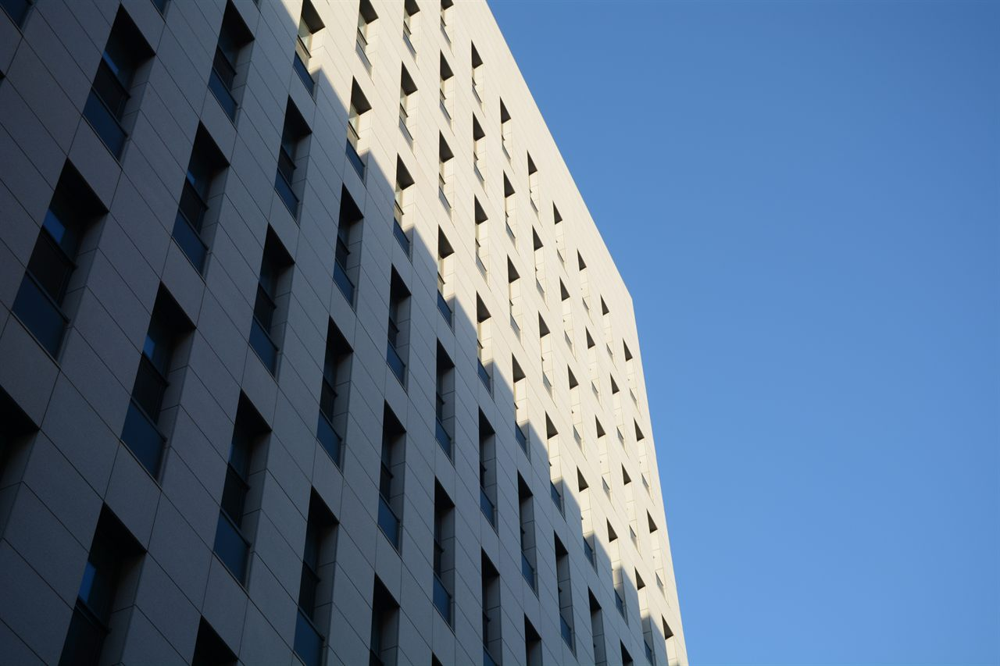
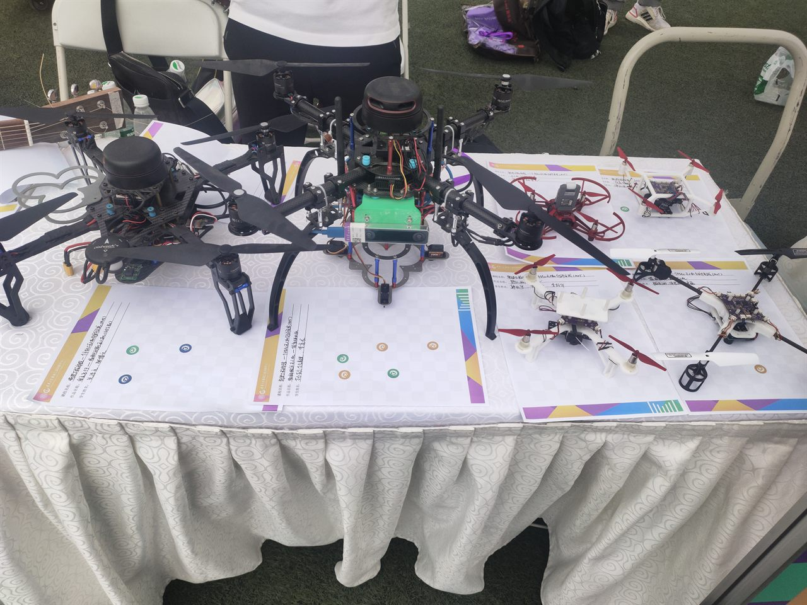
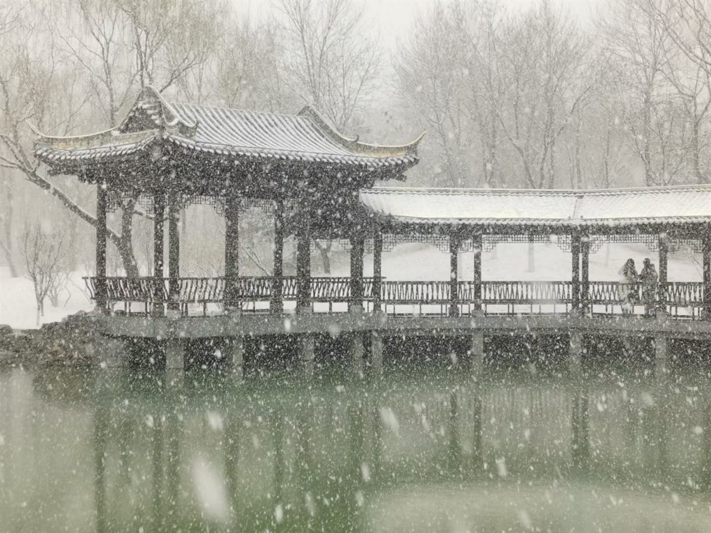
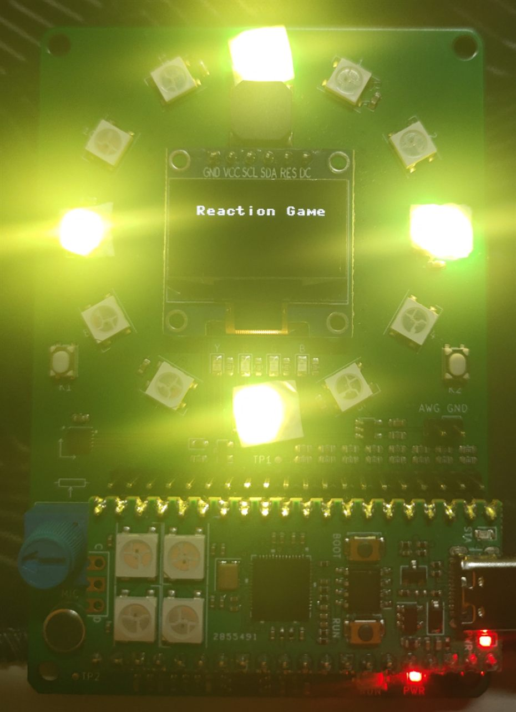

# Beijing Institute of Technology

`B.Eng. Electronic and Information Engineering · Beijing, China · 2019–2023`

In the autumn of 2019 I stepped off the train into Beijing — a shy boy who still smelled of exam paper and small-town certainty, set loose in a capital far too large for him. The city met me with a roar: ring road after ring road of noise and neon, a river of strangers that never once paused for breath, a sky I could seldom find between the towers. For weeks I was simply carried along by it all, a single leaf on very wide water, unsure whether I was truly living in the city or merely being swept through it. It would take me the better part of a year to stop flinching, and to begin, at last, to look up.

 

But great cities are patient teachers, and Beijing taught me in its own unhurried way. It taught me how to be small without being lost; how to make one lit window, one noodle shop, one quiet corner of a library my own; how to stand on my own two feet and truly mean it. Somewhere in that first hard winter the fear thawed, without my ever noticing the moment it happened, into something that felt remarkably like belonging — and one day I realised I had stopped counting down the months until I could go home, because in some quiet way I already was.

 

BIT is where my foundations were poured, and where, for the very first time, I fell in love with the sheer pleasure of understanding things. I learned to read the grammar of the physical world: the way a signal flows and folds through a circuit, the invisible geometry of an electromagnetic field, the patient logic by which a message survives a noisy channel. I let advanced mathematics slowly rewire the way I think, until the equations stopped being obstacles to climb over and quietly became sentences I could read. Whenever a door opened onto a neighbouring discipline, I walked straight through it and carried back whatever I could hold in both arms.

 

And I was never happier than with something half-built in my hands. My fondest hours from those years all seem to have happened well past midnight: a breadboard glowing faintly on a cluttered desk, a stubborn line of code that finally, gloriously behaved, a drone I photographed against the sun one bright afternoon over at Tsinghua and then could not stop thinking about for weeks afterward. None of it was ever assigned or graded — it was simply the shape my curiosity took when no one was watching, and it remains, to this day, the truest evidence I have of who I really am.

 

  
   Beihu, Liangxiang — in the depth of winter

Not all of those years were gentle. Three of the four unfolded under the long grey shadow of the pandemic — plans dissolving overnight, the campus fallen silent, a horizon that kept quietly receding just as I reached for it. I will not pretend those months were anything but hard; there were long stretches when the loneliness carried a real and physical weight. Yet sorrow, like weather, always moves on in the end, and what it leaves behind once the sky finally clears is a kind of steadiness you cannot come by any easier way. What stays with me now are the small, stubborn things: the fat, unbothered geese drifting across a frozen Beihu, wholly indifferent to the cold; the clean geometry of the campus at dusk, when the buildings themselves seemed to exhale. I arrived a boy who had mostly been told what to think, and I left an engineer who was, at last, beginning to think for himself — and that, far more than any diploma, is what Beijing gave me.

 

---

[← Back to profile](https://github.com/ArnoChanPolimi)
