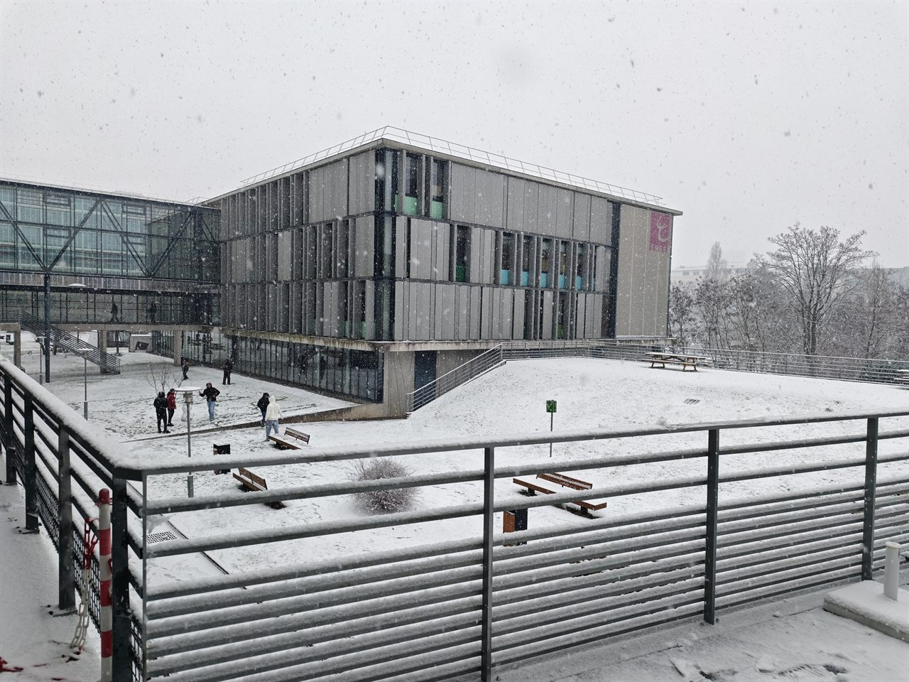
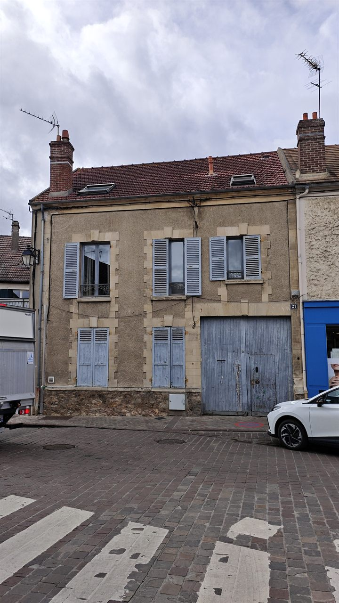

# ENSEA · Cergy, France

`Erasmus exchange — Networks, Telecommunications & Security · Sep 2025 – Jan 2026`

Even now, my exchange semester at ENSEA reads back to me less like a memory than like a dream I once had and cannot quite disown. I can scarcely believe I was ever there at all — a boy from a far and quiet corner of China, set down one autumn in a small French town whose name he had never before heard spoken, watching the season's first snow come down over a campus that was never meant to be any part of his story. Some doors you do not so much choose to walk through as fall through, gratefully, at the one moment you happen not to be looking; and that entire season ran upon the same steady current of quiet disbelief.

 

It began, fittingly, without a roof over my head. For my first week a classmate from the student union simply took me in — his family's old house, La Grange, with a low stone cellar beneath it where we kept parties going deep into the small hours and danced until the very walls appeared to breathe. I have not forgotten a single hour of that week: the unlooked-for warmth of a stranger's table, the wine and the laughter passing round in a language I was still stumbling through, the strange and unearned tenderness of being made so welcome so unimaginably far from anyone I knew. It had the shape of a tale from another century — some village boy carried improbably across the width of the world and taken in without a moment's hesitation. And slowly, week by week, the strangeness wore down into something very close to home. I made friends among the French students, who were patient with my faltering French and generous with their own English, and I learned that human warmth, when one is far from everything familiar, asks for no common tongue at all. I was the foreigner in every room I entered, and yet it never once had the taste of exile — only of being the newest thread drawn into a cloth that kept quietly making room for me.

 

ENSEA taught in a manner I had never before encountered: the grande-école tradition, severe and exacting, founded upon the plain and faintly terrifying assumption that you will rise to meet it. I came to love every difficult hour of it. I spent the term deep among networks — their theory through the mornings, their laboratories through the long afternoons — wiring, breaking, and patiently mending small worlds of my own until at last they consented to behave. And I leaned, without a shred of apology, upon GPT, that tireless and unsleeping tutor so many of us can no longer quite do without.

But what I came to love best of all was the town itself, that quiet place folded into the north-western skirts of Paris. I can see it still — the RER gliding toward the city through the early winter dark, house after little house slipping past the window, each holding up its own small lit square of warmth against the cold. I would sit with my forehead very nearly against the glass and make myself a quiet promise: that one day, somewhere, one of those lit windows would be my own. I came home from France with a heavier suitcase and a lighter, braver heart — and that promise, folded carefully, still travels somewhere inside it.

---

[← Back to profile](https://github.com/ArnoChanPolimi)
