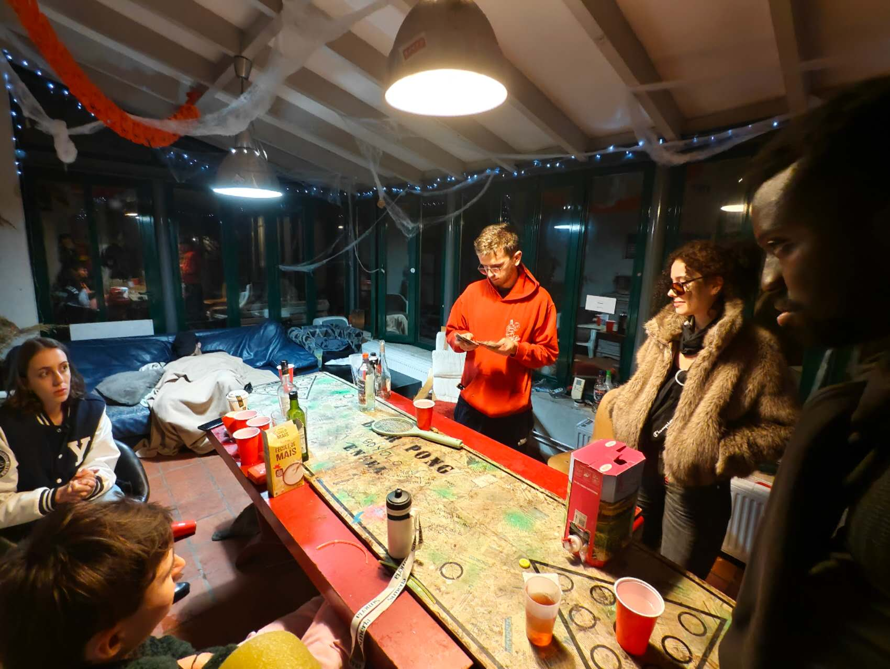

# ENSEA, France · 2025–2026

`Erasmus exchange · Networks, Telecommunications & Security · Cergy, France`

I went to **ENSEA** in Cergy for an Erasmus exchange in **Networks, Telecommunications and Security** from 2025 to 2026. The exchange was short compared with a full degree, but it was dense: a new school, new classmates, a different academic rhythm, and a clearer sense of what it means to study communication systems in an international environment.

In the first days, there were practical things to solve: arrival, housing, schedules, administrative details, and finding my way around Cergy. The town was quieter than Milan, and ENSEA felt more compact. That made the beginning easier to understand.

Snow changed the school immediately. It made the campus less like an institution and more like a place with weather, silence, and a particular season. That mattered to me, because the beginning of an exchange can easily feel administrative. The snow made it personal.

  
   A snow day at ENSEA

ENSEA first became real through ordinary spaces: the lobby, the library, classrooms, doors, schedules, and the small uncertainty of not yet knowing where everything was. I learned the building by moving through it repeatedly. After a few days, the strange became practical; after a few weeks, practical became familiar.

The school was compact enough that people did not remain abstract for long. Faces returned. Conversations continued from one corridor to another. That scale helped me feel less lost than I had expected.

## Settling into Cergy

At the beginning, I did not yet have a permanent room. **Damien**, a classmate from the student union, helped me by welcoming me into his family's old house, La Grange. He was friendly, active, and good at bringing people together. He often organized parties and student activities, and he made the first week feel much less uncertain.

One detail I still remember is that Damien once said my English had an Italian accent. It was a funny comment, but also accurate in its own way. By then, I had already spent enough time in Milan that even my spoken English carried traces of another place.

La Grange had a stone cellar where people gathered at night. There was music, conversation, French moving quickly around me, and English used whenever I needed a bridge back into the group. I did not understand everything immediately, but I did not feel excluded. That mattered a lot in the first days.

  
   An evening at La Grange

La Grange was not important because it was picturesque. It was important because it gave the first week a human shape. A temporary place to sleep became a place where people talked, laughed, cooked, moved around each other, and made room for someone newly arrived.

Small social places around ENSEA worked the same way. They softened the distance between "international student" and "person actually living here." That is often the quiet beginning of belonging: not a grand event, but being invited into ordinary time.

## Courses and classmates

Academically, ENSEA gave the semester a clear technical structure. Networks were not only diagrams in slides; they became addresses, traces, delays, configurations, errors, and experiments that had to be understood carefully. The courses made communication systems feel concrete: packets moving through paths, security assumptions being tested, protocols behaving well or badly depending on the conditions.

There were also the smaller academic scenes that made the exchange real: presenting an idea on a whiteboard, listening to a classmate explain a result, watching a slide change the room from confusion to understanding. These moments were not spectacular, but they made the technical work human.

  
   Presenting at ENSEA

One of the first classmates I met in my program was **Ewan**, whose family came from Tunisia generations before. He was kind, serious, and very hardworking. I respected the way he studied: focused, steady, and without unnecessary display. In December 2025, I visited his home for Christmas. It was a memorable day because it showed me another side of life in France — not only school or travel, but family, food, conversation, and ordinary warmth.

## Beyond campus

The exchange also included the experience of Paris. In the first days, **Janus** took a group of international students around the city. We visited well-known places and took a boat on the Seine. Paris had been one of the cities I imagined when I was young, long before I understood how far it really was from my own life. Seeing it in person felt strange and quiet at the same time: less like checking off a destination, more like realizing that a childhood image had become real.

I also remember walking through the Tuileries Garden with classmates. The gravel under our shoes, the formal lines of trees, the open sky, the light on the buildings — these were simple things, but they stayed in memory because the day itself was easy. No urgent task, no performance, just walking and talking.

Later, in Cergy, I remember standing by the lake with water plants in my hand and throwing them back into the water. It was a small moment, almost too small to explain. The stems were wet and cool, the surface opened, and the rings spread outward before disappearing. It stayed with me because it belonged to ordinary life, not to a planned achievement.

Travel around Europe gave the semester another texture. Strasbourg was not just a postcard city; it showed Europe as public space, institutions, winter sky, and streets where several histories seemed to stand close together. After studying networks and security during the week, I liked seeing how real places also connect and separate people: by language, borders, trains, habits, and memory.

Basel felt quieter, more vertical, more stone-colored. A church wall, a narrow street, a different language on signs — these details were small, but they made the semester feel broader than the classroom. I was learning networks in one sense, and learning Europe in another.

Colmar had another softness: timber, color, winter light, and a kind of tenderness in the buildings. I did not need to turn every trip into a lesson. Sometimes it was enough to walk slowly and let the place remain more detailed than my explanation of it.

  
   Strasbourg and the European Parliament

## Looking back

By winter, snow changed the look of ENSEA and Cergy. The campus became quieter, and the semester began to feel close to its end. I left with better technical confidence in networks and security, but also with friendships and scenes that made the exchange feel personal: Damien at La Grange, Ewan's home at Christmas, Janus guiding us through Paris, the Seine, the garden, the lake.

For me, ENSEA was valuable because it was specific. It was not an abstract "international experience." It was a set of people, places, courses, and days that I can still name.

---

[← Back to profile](https://github.com/ArnoChanPolimi)
