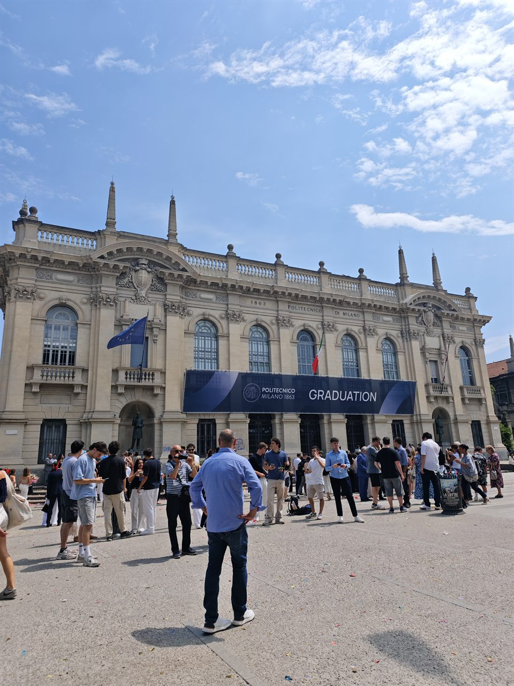
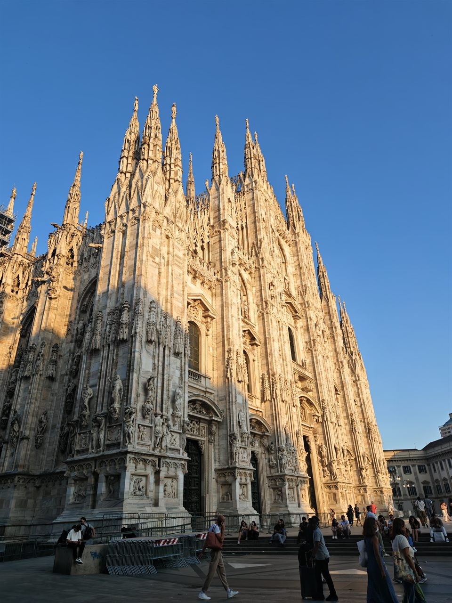
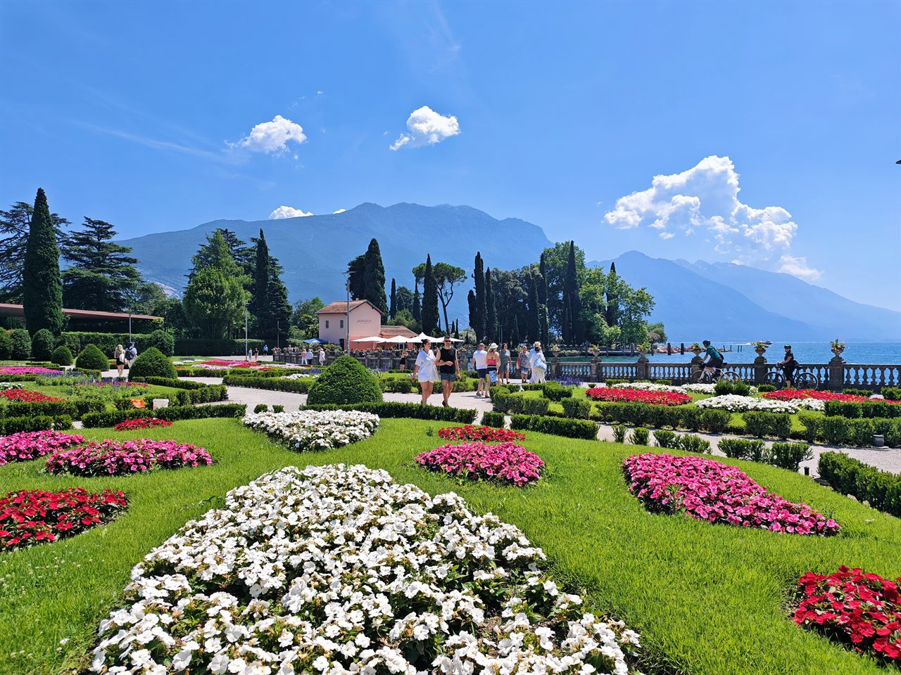
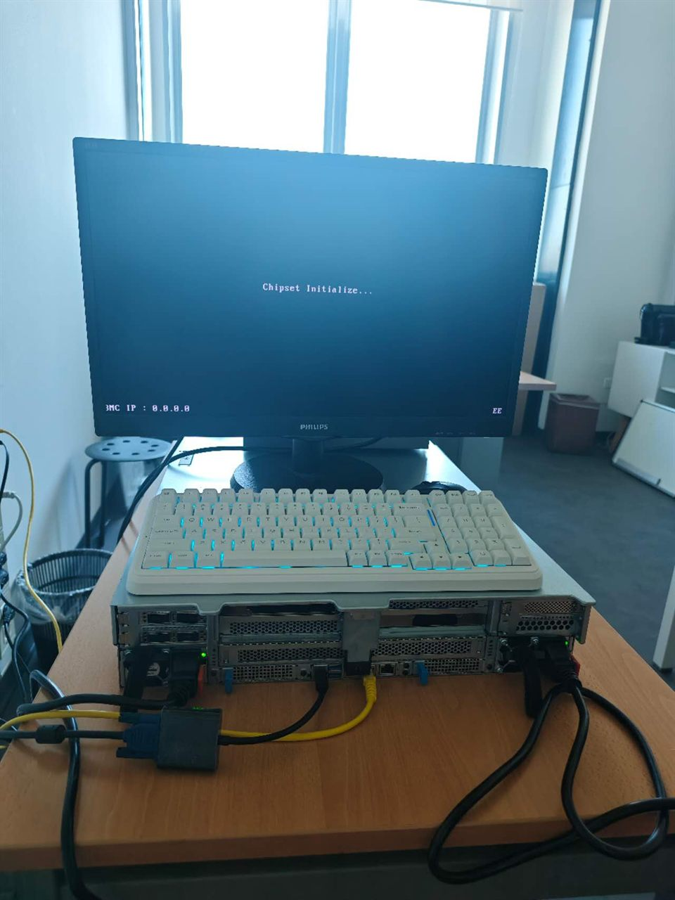

# Politecnico di Milano

`M.Sc. Telecommunication Engineering · Milan, Italy · 2024–2026`

By a chain of happy accidents I found myself at Politecnico di Milano, enrolled in Telecommunication Engineering — the first chapter of my life to be written entirely outside China. I had braced for the ache of being a stranger, for the slow loneliness of a language that was not my own, for long months of quietly counting the days until I could go home again. Instead, almost from the very first week, everything fell improbably into place: the easy rhythm of the lectures, the shape of the streets that soon learned my footsteps, the particular gold of the afternoon light between the old arcades. Some places take years to befriend, and demand that you earn every inch of belonging. Milan was not one of them. It simply opened its door and let me walk straight in, as though it had been quietly expecting me all along.

 

And what a place to be let into. On clear mornings the Alps still ambush me from the ends of ordinary streets — impossibly white, impossibly near, as though someone had propped the whole sky up on the horizon overnight. Lake Garda opens so wide and so blue that you forget it has a far shore at all; stand quietly at its edge and you would swear you were looking at the open sea. Even the Duomo, that vast cliff of carved white stone, refuses to hold still, changing its colour with every passing hour of the day. There is a lightness to living among all of this that I never knew I had been missing — a quiet conviction that even the heaviest week can be carried lightly, so long as the world outside the window keeps insisting on looking like a painting.

 

  
   Riva del Garda — as wide and as blue as an inland sea

The work has lifted me every bit as much as the scenery. My professors here are unsatisfied with any result until it has been chased all the way back to its first principle, and that stubborn patience has, over the months, quietly become my own. My English has grown surer week by week, until one ordinary afternoon I caught myself thinking in it; the tools of the trade now find my hand before I even have to reach for them. Measured against the anxious student who once left Beijing, I can finally see how far I have travelled — not merely more capable, but somehow more fully myself. These days I am living inside my master's thesis, down where the machines that train large models must talk to one another across data centers, and the work is simple to state and endless to do: make that conversation faster, so a run spends more of its life learning and less of it waiting on the network. It is one large problem built from a hundred smaller ones I cannot yet solve — which is precisely why I love it. I have never once wanted to arrive; arrival is a kind of ending, and I am not finished. I only ever wanted to keep climbing.

 

---

[← Back to profile](https://github.com/ArnoChanPolimi)
